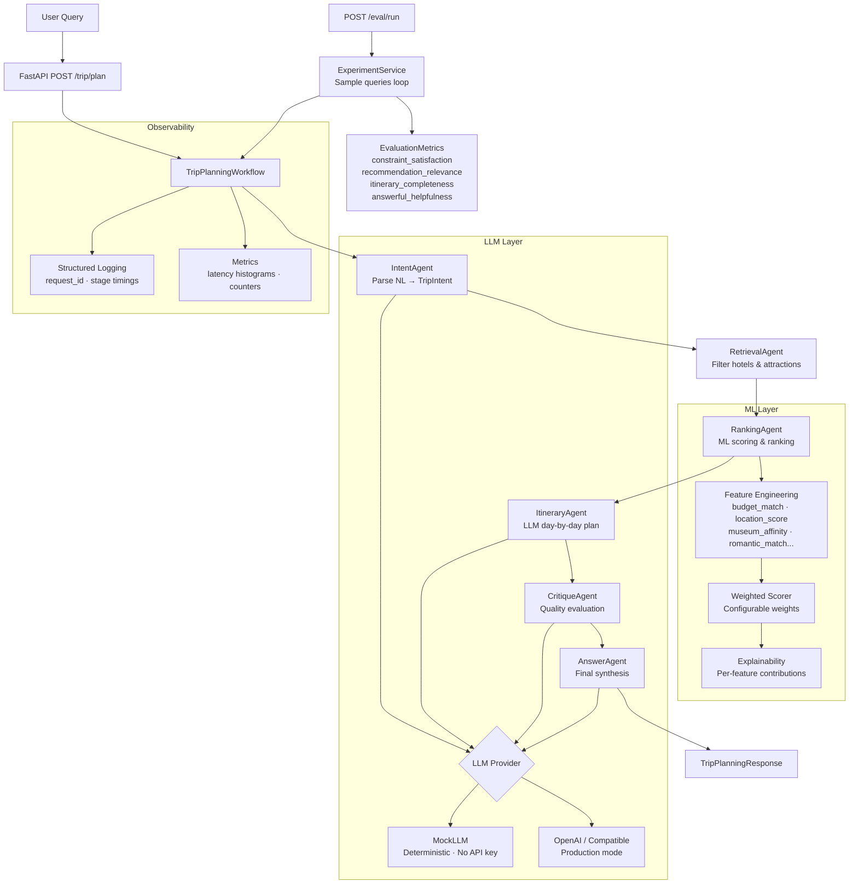

# TripGenie — Agentic Travel Planning & Booking Assistant

[](https://github.com/tripgenie/tripgenie-agentic-travel-assistant/actions)
[](https://python.org)
[](https://fastapi.tiangolo.com)
[](LICENSE)
[](https://docs.astral.sh/ruff/)

> **An LLM-powered, agentic travel planning assistant with ML-based hotel ranking, structured itinerary generation, quality evaluation, and full observability — demonstrating production-grade GenAI engineering practices.**

---

## Why This Project Exists

TripGenie is a portfolio project built to demonstrate the intersection of **GenAI engineering**, **ML system design**, and **travel product thinking** — the core skill set for Senior ML Engineer roles at companies like Booking.com, Airbnb, and Expedia.

The system simulates a realistic internal prototype for an AI travel assistant team:

- **Agentic workflow** with clearly defined stages, typed shared state, and graceful degradation
- **Provider-agnostic LLM abstraction** — runs fully offline in mock mode, connects to OpenAI-compatible APIs in production
- **Transparent ML ranking** — interpretable weighted scorer with per-feature contribution breakdowns
- **Offline evaluation framework** — quantitative metrics for constraint satisfaction, recommendation relevance, itinerary completeness, and answer helpfulness
- **Production-grade engineering** — FastAPI, Pydantic v2, structured logging, Docker, CI/CD, pre-commit, mypy, Ruff

---

## Architecture



---

## Repository Structure

```
tripgenie-agentic-travel-assistant/
├── README.md
├── pyproject.toml              # Project metadata, dependencies, tool config
├── Makefile                    # Developer commands
├── Dockerfile                  # Multi-stage production image
├── docker-compose.yml          # API + Streamlit UI services
├── .env.example                # Environment variable documentation
├── .pre-commit-config.yaml     # Ruff + mypy pre-commit hooks
│
├── .github/workflows/
│   └── ci.yml                  # Lint, type-check, test, Docker build
│
├── configs/
│   ├── app.yaml                # Application configuration
│   ├── prompts.yaml            # All LLM prompt templates
│   └── logging.yaml            # Logging configuration
│
├── data/
│   ├── hotels.csv              # 60 hotels across 5 European cities
│   ├── attractions.csv         # 40+ attractions with tags and ratings
│   ├── restaurants.csv         # 30+ restaurants with cuisine and features
│   ├── city_guides.json        # City-level travel reference data
│   └── sample_user_queries.json # 10 evaluation queries with expected outputs
│
├── notebooks/
│   └── exploration.ipynb       # Dataset EDA + ranking system walkthrough
│
├── app/
│   ├── main.py                 # FastAPI application factory
│   ├── api/
│   │   ├── routes_health.py    # GET /health, GET /metrics
│   │   ├── routes_trip.py      # POST /trip/plan
│   │   └── routes_eval.py      # POST /eval/run
│   ├── core/
│   │   ├── config.py           # Pydantic Settings + YAML overlay
│   │   ├── logging.py          # structlog setup
│   │   ├── metrics.py          # In-process counters + histograms
│   │   └── exceptions.py       # Typed exception hierarchy
│   ├── schemas/
│   │   ├── domain.py           # TripIntent, Hotel, RankedHotel, Itinerary...
│   │   ├── requests.py         # API request models
│   │   └── responses.py        # API response models
│   ├── agents/
│   │   ├── state.py            # TripPlanningState (shared workflow state)
│   │   ├── intent_agent.py     # NL → TripIntent
│   │   ├── retrieval_agent.py  # TripIntent → candidates
│   │   ├── ranking_agent.py    # candidates → ranked hotels
│   │   ├── itinerary_agent.py  # → day-by-day plan
│   │   ├── critique_agent.py   # → quality assessment
│   │   ├── answer_agent.py     # → final response
│   │   ├── workflow.py         # Pipeline orchestration
│   │   └── planner.py          # API entry point
│   ├── services/
│   │   ├── llm.py              # Mock + OpenAI LLM providers
│   │   ├── prompt_manager.py   # YAML template rendering
│   │   ├── dataset_service.py  # CSV/JSON data loading
│   │   ├── retrieval_service.py
│   │   ├── ranking_service.py
│   │   ├── itinerary_service.py
│   │   ├── helpfulness_service.py
│   │   └── experiment_service.py
│   ├── ml/
│   │   ├── features.py         # Feature engineering functions
│   │   ├── ranker.py           # Weighted linear scorer
│   │   └── eval_metrics.py     # Evaluation metric computation
│   ├── utils/
│   │   ├── text.py
│   │   └── dates.py
│   └── ui/
│       └── streamlit_app.py    # Interactive demo UI
│
└── tests/
    ├── test_health.py
    ├── test_trip_api.py        # Full API integration tests
    ├── test_ranking.py         # ML ranking unit tests
    ├── test_workflow.py        # Agent pipeline tests
    └── test_eval.py            # Evaluation framework tests
```

---

## Quick Start

### Prerequisites

- Python 3.11+
- pip

### Installation

```bash
# Clone the repository
git clone https://github.com/tripgenie/tripgenie-agentic-travel-assistant.git
cd tripgenie-agentic-travel-assistant

# Install with dev dependencies
pip install -e ".[dev]"

# Copy environment configuration
cp .env.example .env
```

### Run the API (mock mode — no API key needed)

```bash
# Using Makefile
make run-dev

# Or directly
uvicorn "app.main:create_app" --factory --host 0.0.0.0 --port 8000 --reload
```

The API will be available at:
- **API:** http://localhost:8000
- **Interactive docs:** http://localhost:8000/docs
- **Health check:** http://localhost:8000/health

### Run the Streamlit UI

```bash
# In a separate terminal
make ui

# Or directly
streamlit run app/ui/streamlit_app.py
```

The UI will be available at http://localhost:8501

### Run with Docker

```bash
# Build and start API + UI
make docker-up

# Or with docker compose directly
docker compose up -d
```

---

## Configuration

### Environment Variables

Copy `.env.example` to `.env` and adjust as needed:

```env
# Run in mock mode (default, no API key needed)
LLM_PROVIDER=mock

# Or use the real OpenAI API
LLM_PROVIDER=openai
OPENAI_API_KEY=sk-your-key-here
LLM_MODEL=gpt-4o-mini

# Or any OpenAI-compatible endpoint (Ollama, Azure, etc.)
LLM_PROVIDER=openai_compatible
OPENAI_BASE_URL=http://localhost:11434/v1
```

### YAML Configuration

All non-secret configuration lives in `configs/app.yaml`:

```yaml
ranking:
  top_k: 5
  feature_weights:
    budget_match: 0.25
    location_score: 0.20
    review_score: 0.18
    # ... adjustable without code changes
```

---

## API Reference

### `GET /health`

```json
{
  "status": "ok",
  "version": "0.1.0",
  "environment": "development",
  "llm_provider": "mock",
  "timestamp": "2026-03-12T10:30:00Z"
}
```

### `POST /trip/plan`

**Request:**
```json
{
  "query": "I want a 4-day Amsterdam trip for a couple, mid-range budget, close to museums and public transport, with a canal cruise.",
  "travelers": 2,
  "interests": ["museums", "canal cruise"],
  "use_llm": true
}
```

**Response (abbreviated):**
```json
{
  "request_id": "a3f9b2c1",
  "parsed_intent": {
    "city": "Amsterdam",
    "days": 4,
    "travelers": 2,
    "budget_level": "mid",
    "interests": ["museums", "canal cruise", "canals"],
    "travel_style": "cultural"
  },
  "ranked_hotels": [
    {
      "rank": 1,
      "score": 0.8743,
      "hotel": {
        "name": "Museum Quarter Inn",
        "city": "Amsterdam",
        "price_level": 2,
        "avg_review_score": 8.6,
        "location_score": 8.8,
        "near_museum": true,
        "near_public_transport": true
      },
      "feature_contributions": [
        {"feature": "budget_match", "raw_value": 1.0, "weight": 0.25, "contribution": 0.25},
        {"feature": "museum_affinity", "raw_value": 1.0, "weight": 0.08, "contribution": 0.08}
      ],
      "explanation": "Ranked #002 with 87% match. Strongest signals: budget compatibility, location quality, and proximity to museums."
    }
  ],
  "itinerary": {
    "trip_name": "Amsterdam Canals & Culture",
    "total_days": 4,
    "days": [
      {
        "day": 1,
        "theme": "Arrival & Canal Heart",
        "morning": "Stroll through Jordaan, breakfast at a Dutch bruin café...",
        "afternoon": "Visit the Rijksmuseum...",
        "evening": "Evening canal cruise, dinner at Buffet van Odette..."
      }
    ],
    "practical_tips": ["Book museum tickets well in advance...", "..."]
  },
  "final_answer": "Amsterdam is one of Europe's most rewarding city break destinations...",
  "critique": {
    "overall_score": 0.88,
    "approved": true,
    "budget_respected": true,
    "duration_included": true,
    "activities_sufficient": true
  },
  "stage_latencies": {
    "intent": 12.3,
    "retrieval": 4.1,
    "ranking": 8.7,
    "itinerary": 25.4,
    "critique": 18.2,
    "answer": 22.1
  },
  "total_latency_ms": 90.8,
  "metadata": {
    "llm_provider": "mock",
    "llm_calls": 3,
    "mock_llm_used": true,
    "candidate_count": 12
  }
}
```

### `POST /eval/run`

**Request:**
```json
{
  "num_samples": 5,
  "verbose": true
}
```

**Response:**
```json
{
  "num_queries": 5,
  "successful": 5,
  "failed": 0,
  "avg_latency_ms": 95.4,
  "avg_constraint_satisfaction": 0.917,
  "avg_recommendation_relevance": 0.783,
  "avg_itinerary_completeness": 0.891,
  "avg_helpfulness_score": 0.842,
  "avg_overall_score": 0.858,
  "summary": "Evaluation complete: 5 queries succeeded, 0 failed. Average overall score: 0.858 (Excellent)."
}
```

---

## Tests

```bash
# Run full test suite
make test

# With coverage report
make test-cov

# Specific test file
pytest tests/test_ranking.py -v
```

---

## Agent Workflow

TripGenie uses a **custom lightweight state machine** — similar in concept to LangGraph but without the dependency overhead.

Each agent is a plain Python class with a `run(state) -> state` interface. The `TripPlanningWorkflow` instantiates all agents with their required services and executes them sequentially, passing the shared `TripPlanningState` through each stage.

| Stage | Agent | Input | Output |
|-------|-------|-------|--------|
| 1 | IntentAgent | Natural language query | `TripIntent` (city, days, budget, interests...) |
| 2 | RetrievalAgent | `TripIntent` | Candidate hotels, attractions, restaurants |
| 3 | RankingAgent | Candidates + `TripIntent` | `RankedHotel[]` with scores |
| 4 | ItineraryAgent | Ranked hotels + attractions | Day-by-day `Itinerary` |
| 5 | CritiqueAgent | Full plan | `Critique` quality assessment |
| 6 | AnswerAgent | All outputs | Final natural language response |

**Resilience:** Each agent has its own error handling. If a non-critical stage fails, the pipeline continues with whatever state is available rather than blocking.

**Observability:** Each stage records its latency to `state.stage_latencies`. All log lines carry `request_id` for distributed tracing.

---

## Ranking Logic

The hotel ranker uses a **weighted linear scorer** — the same architecture used in production recommendation systems before moving to learned models.

### Feature Set

| Feature | Description | Signal |
|---------|-------------|--------|
| `budget_match` | Distance between hotel price level and requested budget | 1.0 = perfect match |
| `location_score` | Normalised hotel location score | `location_score / 10` |
| `review_score` | Normalised guest review score | `avg_review_score / 10` |
| `transport_match` | Near public transport × user cares about transport | 0.5 neutral if unconstrained |
| `museum_affinity` | Near museum × cultural interest | 0.5 neutral if unconstrained |
| `romantic_match` | Romantic hotel × romantic/couple travel style | 0.5 neutral |
| `family_match` | Family-friendly × family travel style | 0.5 neutral |
| `nightlife_match` | Near nightlife × nightlife interest | 0.5 neutral |
| `business_match` | Business-friendly × business travel style | 0.5 neutral |

**Key design principle:** Features return 0.5 (neutral) when the user hasn't expressed a preference for that dimension. This prevents unfair penalisation of hotels for features the user didn't ask for.

### Scoring Formula

```
score = Σ (feature_value_i × weight_i)   where Σ weights = 1.0
```

Weights are configurable in `configs/app.yaml` and normalised to sum to 1.0. In a production system, weights would be learned from booking/click data.

### Explainability

Every `RankedHotel` includes:
- `score`: total weighted score in [0, 1]
- `feature_contributions`: per-feature breakdown (raw value, weight, contribution)
- `explanation`: human-readable natural language reason

---

## Evaluation Framework

The `/eval/run` endpoint runs the full pipeline against 10 curated sample queries and computes aggregate metrics.

### Metrics

| Metric | Description | Computation |
|--------|-------------|-------------|
| `constraint_satisfaction` | Did intent extraction capture the right city, days, and budget? | City match + day tolerance + budget match |
| `recommendation_relevance` | Do top hotels align with stated interests? | Feature-interest overlap weighted by rank |
| `itinerary_completeness` | Does the itinerary cover all requested days with sufficient activities? | Day coverage + activities/day + tips presence |
| `answer_helpfulness` | Is the final answer specific, actionable, and well-structured? | Length + city mention + practical advice + specificity |

All metrics return floats in [0, 1] where 1.0 is best. They are designed to work without ground-truth labels using proxy signals from the structured data.

---

## Future Improvements

- **Learned ranker:** Replace weighted linear scorer with an XGBoost or LightGBM model trained on user click/booking data
- **Multi-city itineraries:** Support cross-city trips (e.g. Paris → Amsterdam in 7 days)
- **Real-time availability:** Integration with hotel inventory API for price and availability signals
- **Personalisation:** User preference profiles stored between sessions
- **A/B testing framework:** Built-in experimentation for prompt variants and ranking weights
- **LangGraph migration:** Replace the custom state machine with LangGraph for more flexible DAG-based workflows
- **Streaming responses:** SSE/WebSocket streaming for real-time itinerary generation
- **RAG for city knowledge:** Vector store with detailed neighbourhood and attraction data
- **Feedback loop:** Capture user rating of plan quality to improve evaluation metrics

---

## Screenshots

| Trip Planner | Hotel Rankings | Day-by-Day Itinerary |
|---|---|---|
| *(Streamlit UI — query input and parsed intent)* | *(Ranked hotels with score breakdown)* | *(Day themes, activities, transport tips)* |

---

## Why This Fits Travel-Tech / Booking-Style GenAI Roles

This project directly mirrors the engineering challenges at companies building AI-powered travel products:

1. **Agentic orchestration** — Multi-step pipelines where each agent has a distinct responsibility, shared state, and graceful error handling. This is the architecture pattern used in production travel assistant systems.

2. **LLM evaluation without ground truth** — The evaluation framework uses proxy metrics computable from structured data, solving the core practical challenge of evaluating LLM-powered products at scale.

3. **Transparent recommendation ranking** — The feature-weighted ranker with contribution breakdowns mirrors how modern recommendation systems explain their outputs to users and stakeholders.

4. **Provider-agnostic design** — The LLM abstraction layer with mock/real switching is essential for teams that need to evaluate multiple LLM providers without rewriting application logic.

5. **Production engineering practices** — Typed domain models, structured logging with request tracing, configuration management, Docker deployment, and a proper CI pipeline — the full production stack, not just a demo script.

6. **Quality and latency tradeoffs** — The evaluation metrics track both output quality and latency, reflecting the core tradeoff that drives ML system design decisions at travel companies.

---

## Setup for Development

```bash
# Install with dev tools
make install-dev

# Set up pre-commit hooks
pre-commit install

# Run linting + type checking
make check

# Auto-fix linting issues
make fix

# Start with hot reload
make run-dev
```

---

## License

MIT License — see [LICENSE](LICENSE) for details.

---

*Built as a Senior ML Engineer portfolio project demonstrating production-grade GenAI engineering for travel tech applications.*
